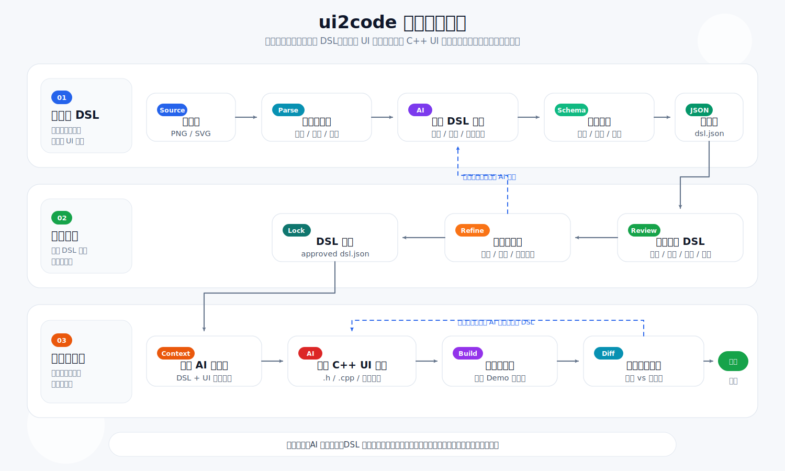

# ui2code 调研方案

## 1. 为什么需要 ui2code 这样的解决方案？

当前 UI 从设计稿到 C++ UI 代码通常依赖人工还原，主要问题包括：

- 设计稿中的坐标、尺寸、颜色、圆角、字体、层级关系需要人工抄写，效率低且容易出错。
- 自研 C++ UI 框架往往没有成熟的设计稿导入链路，无法直接复用 Web / Flutter / Qt 等生态工具。
- 仅依赖 PNG 截图反推 UI 信息时，图层、语义、字体、组件类型、资源引用都会丢失，还原质量不稳定。
- 后续设计改版时，人工维护 C++ UI 代码成本高，难以形成可重复、可验证的流程。

因此，ui2code 的核心价值不是简单地“从图片生成代码”，而是建立一条稳定的设计稿到 UI 代码生产链路：

```text
MasterGo 设计数据
  -> UI DSL
  -> C++ UI Code Generator
  -> 自研 C++ UI 渲染
  -> 截图对比验证
```

如果输入只有 PNG，可以作为兜底方案处理；但如果输入来自 MasterGo，优先使用 MasterGo 图层数据导出 DSL，准确率和可维护性都明显更好。

## 2. 当前市面上有哪些成熟的解决方案？

从 GitHub 和现有工具链看，目前没有成熟开源项目可以可靠完成：

```text
任意 PNG 截图 -> 自研 C++ UI 代码
```

现有方案大致分为几类：

| 方向 | 代表项目 | 结论 |
|---|---|---|
| 截图转前端代码 | [screenshot-to-code](https://github.com/abi/screenshot-to-code), [ScreenCoder](https://github.com/leigest519/ScreenCoder) | 可生成 HTML/CSS/React/Vue 等 Web UI，但不面向 C++ UI。 |
| 图像识别 UI 元素 | [UIED](https://github.com/MulongXie/UIED), [UI2CODE](https://github.com/MulongXie/UI2CODE) | 可从截图识别控件区域并输出结构化结果，适合作为 PNG 兜底识别模块参考。 |
| 设计稿转代码 | [imgcook](https://github.com/imgcook/imgcook), [FigmaToCode](https://github.com/bernaferrari/FigmaToCode) | 更适合从设计稿结构化数据生成 Web / 多端代码，思路可参考。 |
| 设计稿转 Qt / QML | [design2apps](https://github.com/Mordekai66/design2apps), [FigmaQML](https://github.com/mmertama/FigmaQML) | 证明“设计稿数据 -> C++/Qt 生态代码”方向可行，但不能直接覆盖自研 UI 框架。 |
| MasterGo 插件生态 | MasterGo 插件 API、社区 JSON/资源导出插件、MasterGo2Figma | 可直接读取 MasterGo 图层树、属性和资源，是本项目最值得采用的主路线。 |

调研结论：

- 不建议把主路线设计成 `PNG -> C++`。
- 推荐采用 `MasterGo -> DSL -> C++`。
- PNG 识别只作为历史图片、无源设计稿或自动校验时的辅助能力。

## 3. 目标

本项目目标是搭建一套面向自研 C++ UI 框架的设计稿转代码链路。

核心目标：

- 从 MasterGo 选中的画板、Frame 或组件中导出结构化 UI 数据。
- 将 MasterGo 节点转换为稳定、框架无关的 UI DSL。
- 基于 UI DSL 生成自研 C++ UI 代码。
- 支持文本、图片、面板、圆角矩形、边框、图标、线条、箭头、表格、分组等常见 UI 元素。
- 保留原始 MasterGo 节点信息，便于调试、增量更新和问题定位。
- 生成代码后可通过截图与设计稿导出 PNG 做视觉对比。

非目标：

- 第一阶段不追求任意复杂设计稿 100% 自动还原。
- 第一阶段不把交互逻辑、数据绑定、动画作为重点。
- 第一阶段不直接依赖某个第三方设计转代码格式作为最终 DSL。

## 4. 解决方案

### 4.1 最终优化流程：AI 辅助 DSL + AI 辅助代码生成

最终方案采用两段式 AI 生成，中间加入人工确认和规范校验：

```text
PNG / SVG 输入源
  -> AI 生成 dsl.json
  -> 人工确认 DSL 是否符合预期
  -> 将 dsl.json + UI 框架使用说明提供给 AI
  -> AI 生成 C++ UI 代码
  -> 编译渲染
  -> 截图对比
  -> 根据差异反馈修正
```

流程图如下：



优化点：

- AI 不直接从图片一步生成 C++ 代码，而是先生成可审查、可修正、可版本化的 DSL。
- SVG 输入优先解析结构信息，PNG 输入走视觉识别和语义推断。
- `dsl.json` 是流程中的关键门禁，人工确认通过后再进入代码生成阶段。
- UI 框架使用说明和 DSL 一起输入给 AI，避免 AI 生成脱离实际框架 API 的代码。
- 生成代码后必须进入编译、渲染、截图对比闭环，不通过时反馈给 AI 修正代码或 DSL。

推荐拆成 5 个核心模块：

| 模块 | 输入 | 输出 | 职责 |
|---|---|---|---|
| 输入预处理 | PNG / SVG | 标准化资源描述 | 提取尺寸、资源路径、基础颜色、SVG 结构或 PNG 视觉信息。 |
| AI DSL 生成 | 标准化资源描述、DSL 规范 | `dsl.draft.json` | 识别 UI 元素、层级、坐标、样式和资源映射。 |
| DSL 审查与校验 | `dsl.draft.json` | `dsl.json` | 人工确认语义，Schema 校验字段、坐标、资源和控件类型。 |
| AI 代码生成 | `dsl.json`、UI 框架说明 | C++ UI 代码 | 生成 `.h/.cpp`、资源引用、控件创建、布局和样式设置。 |
| 渲染验证 | 原图、C++ 渲染截图 | 差异报告 | 对比坐标、颜色、文字、图片、圆角、边框和层级。 |

该方案的核心是把 AI 放在“生成初稿”和“根据反馈修正”的位置，把 DSL 和渲染结果作为可控的质量门禁。

### 4.2 可选增强：MasterGo 插件直导 DSL

优先实现一个 `MasterGoToUIDSL` 插件：

```text
MasterGo 选中画板/容器
  -> 插件遍历图层树
  -> 提取节点属性
  -> 导出图片/SVG资源
  -> 生成 ui.dsl.json + assets/
  -> C++ Generator 生成自研 UI 代码
```

这样可以直接获得 MasterGo 的结构化设计数据，包括：

- 节点类型
- 图层树层级
- x/y/width/height
- 文本内容
- 字体、字号、字重、颜色、对齐方式
- fills、strokes、cornerRadius、effects
- 自动布局信息
- 图片、SVG、矢量资源
- 组件实例与组件名称

推荐 DSL 结构：

```json
{
  "version": "1.0",
  "source": {
    "tool": "MasterGo",
    "fileId": "",
    "pageId": "",
    "frameId": ""
  },
  "page": {
    "className": "AgentArchitecturePage",
    "width": 1536,
    "height": 1043,
    "background": "#FFFFFF"
  },
  "root": {
    "id": "main_frame",
    "name": "主画板",
    "sourceType": "FRAME",
    "type": "Panel",
    "layout": {
      "x": 0,
      "y": 0,
      "width": 1536,
      "height": 1043
    },
    "style": {},
    "children": []
  },
  "assets": []
}
```

节点转换示例：

```json
{
  "id": "title",
  "name": "标题",
  "sourceType": "TEXT",
  "type": "Label",
  "props": {
    "text": "Agent 常见架构范式图解"
  },
  "layout": {
    "x": 430,
    "y": 10,
    "width": 700,
    "height": 58,
    "rotation": 0
  },
  "style": {
    "fontSize": 44,
    "fontWeight": 700,
    "fontColor": "#000000",
    "align": "center"
  },
  "codegen": {
    "targetComponent": "NMLabel",
    "variableName": "m_title"
  }
}
```

### 4.3 快速验证方案：MasterGo JSON 导出插件 + Converter

如果要快速验证链路，可以先使用 MasterGo 社区已有 JSON 导出插件或资源导出插件：

```text
MasterGo JSON/资源导出插件
  -> 原始 JSON
  -> ui2code-converter
  -> UI DSL
  -> C++ Generator
```

优点：

- 快速验证可行性。
- 不需要一开始完整开发 MasterGo 插件。
- 可以优先测试 DSL 结构和 C++ 生成器。

缺点：

- 原始 JSON 字段不一定稳定。
- 资源导出、组件语义和代码生成字段可能不符合自研需求。
- 长期维护会受第三方插件格式限制。

因此该方案适合 POC，不建议作为最终主线。

### 4.4 兜底方案：PNG 识别生成 DSL

当只有 PNG，没有 MasterGo 源数据时，可以使用识别链路：

```text
PNG
  -> OCR / CV / VLM 识别
  -> UI DSL
  -> 人工校正
  -> C++ Generator
```

可参考 UIED / UI2CODE 的思路，识别：

- 文本和文本框
- 矩形、圆角矩形、边框
- 图片和图标区域
- 线条、箭头
- 表格和分组
- 大致层级关系

该方案只能作为兜底，因为 PNG 丢失了真实图层和组件语义。

## 5. 实现细节

### 5.1 MasterGo 节点到 DSL 类型映射

| MasterGo 节点 | DSL 类型 | 说明 |
|---|---|---|
| FRAME | Panel | 页面、画板、容器 |
| GROUP | Group / Panel | 分组容器 |
| TEXT | Label | 文本控件 |
| RECTANGLE | Shape / Panel / Button 候选 | 根据命名、样式和子节点判断 |
| LINE / CONNECTOR | Line / Arrow | 流程连线 |
| ELLIPSE | Shape | 圆形、图标背景 |
| VECTOR / PEN | Vector / Image | 复杂矢量可导出资源 |
| INSTANCE | Component / Button / Image | 优先保留组件名和主组件信息 |
| IMAGE 填充节点 | Image | 导出 PNG/WebP 等资源 |

### 5.2 DSL 字段设计

每个节点建议保留以下字段：

```json
{
  "id": "",
  "name": "",
  "sourceType": "",
  "type": "",
  "props": {},
  "layout": {},
  "style": {},
  "state": {},
  "binding": {},
  "events": {},
  "animation": {},
  "codegen": {},
  "children": []
}
```

字段职责：

- `props`：控件业务属性，例如文本、图片路径、placeholder。
- `layout`：位置、尺寸、锚点、自动布局、间距。
- `style`：颜色、字体、边框、圆角、阴影、透明度。
- `state`：hover、pressed、disabled 等状态样式。
- `events`：点击、输入、选中等事件。
- `codegen`：目标 C++ 控件类型、变量名、继承信息。
- `children`：子控件。

### 5.3 C++ 代码生成

DSL 到 C++ 的生成应保持简单、可读、可调试：

```cpp
m_title = CreateWidget<NMLabel>("title");
m_title->SetRect(430, 10, 700, 58);
m_title->SetText(u8"Agent 常见架构范式图解");
m_title->SetFontSize(44);
m_title->SetFontWeight(700);
m_title->SetTextColor(Color::FromHex("#000000"));
AddChild(m_title);
```

生成器建议分层：

```text
DSL Parser
  -> Widget Model
  -> C++ AST / Template
  -> .h / .cpp
```

### 5.4 资源导出

资源建议独立输出：

```text
output/
  ui.dsl.json
  assets/
    title_icon.svg
    bg_panel.png
    flow_icon_react.svg
  generated/
    AgentArchitecturePage.h
    AgentArchitecturePage.cpp
```

资源规则：

- 简单矩形、圆角、边框优先转成代码样式。
- 复杂图标、矢量、多层组合优先导出为 SVG/PNG 资源。
- 图片节点保留原始资源路径和导出路径。
- 大块复杂装饰可以作为 Image 处理，减少代码生成复杂度。

### 5.5 验证闭环

生成 C++ 后需要做渲染验证：

```text
MasterGo 导出 PNG
  vs
C++ UI 渲染截图
```

检查项：

- 页面尺寸是否一致。
- 元素坐标和尺寸误差。
- 文字内容、字号、颜色是否接近。
- 圆角、边框、背景色是否接近。
- 图片、图标、箭头是否缺失。
- 文本是否溢出或重叠。

## 6. 最佳实践

- 优先从 MasterGo 图层数据导 DSL，不要优先从 PNG 反推。
- DSL 必须框架无关，不要直接绑定 React、Flutter、Qt 或某个自研 C++ 控件类。
- `codegen` 字段可以包含目标 C++ 控件信息，但不要污染通用 UI 描述。
- 保留 `sourceType`、原始节点 id、原始节点 name，方便回溯设计稿。
- 插件第一阶段只导出静态 UI，交互、动画、数据绑定后续再扩展。
- 组件识别应结合节点类型、图层命名、组件名、样式和子节点，而不是只看形状。
- 对复杂矢量和图标，优先导出资源，不强行拆成大量 Shape。
- 建立人工校正 DSL 的能力，避免追求一次性全自动。
- 每次生成后保留设计稿截图和渲染截图，形成可回归的视觉测试集。

## 7. 后续计划

### 第一阶段：验证链路

- 定义 UI DSL v1。
- 准备 2 到 3 个 MasterGo 样例页面。
- 使用 MasterGo JSON/资源导出能力获取原始数据。
- 编写 converter，将原始数据转为 UI DSL。
- 编写最小 C++ Generator，支持 Panel、Label、Image、Shape。

### 第二阶段：开发 MasterGo 插件

- 支持选择画板导出。
- 支持遍历图层树。
- 支持导出文本、矩形、图片、SVG、分组、组件实例。
- 支持打包 `ui.dsl.json + assets.zip`。
- 支持基础日志和错误提示。

### 第三阶段：完善 C++ 生成器

- 支持 Button、Edit、CheckBox、List、ScrollView 等控件。
- 支持状态样式、事件绑定和变量命名规则。
- 支持 `.h/.cpp` 分文件生成。
- 支持按自研 UI 框架规范生成代码。

### 第四阶段：验证和自动化

- 增加渲染截图导出。
- 增加与 MasterGo PNG 的视觉 diff。
- 建立样例库和回归测试。
- 支持 CI 中自动检查 DSL 和代码生成结果。

## 8. 总体结论

本项目不应把重点放在“PNG / SVG 直接生成 C++ 代码”。更稳妥的工程路线是：

```text
PNG / SVG 输入源
  -> AI 生成 DSL
  -> 人工确认 DSL
  -> DSL + UI 框架说明
  -> AI 生成 C++ UI 代码
  -> 编译渲染与截图验证
```

最终方案的关键不是让 AI 一次性生成最终代码，而是通过 `dsl.json` 把视觉还原、人工确认和代码生成解耦。

最终建议先做一个小闭环：

```text
PNG / SVG 样例
  -> AI 生成 dsl.json
  -> 人工确认和修正
  -> AI 根据 UI 框架说明生成 C++ 静态 UI
  -> 编译渲染
  -> 与原图截图对比
```

这个闭环跑通后，再逐步扩展控件类型、交互事件、组件语义和自动化验证。
